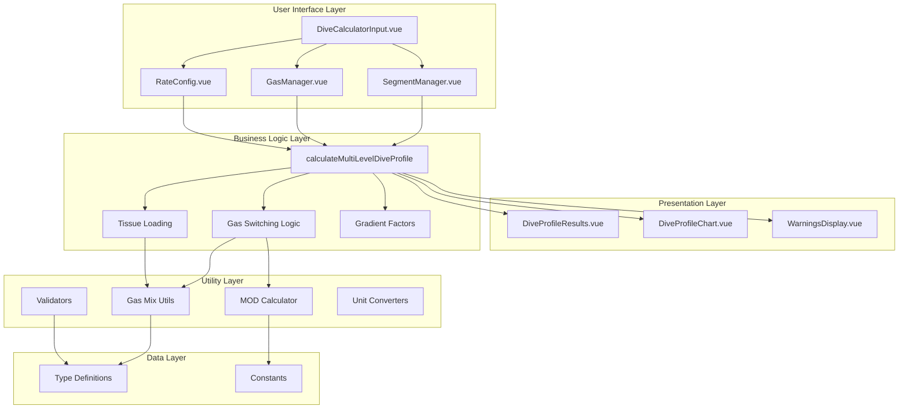
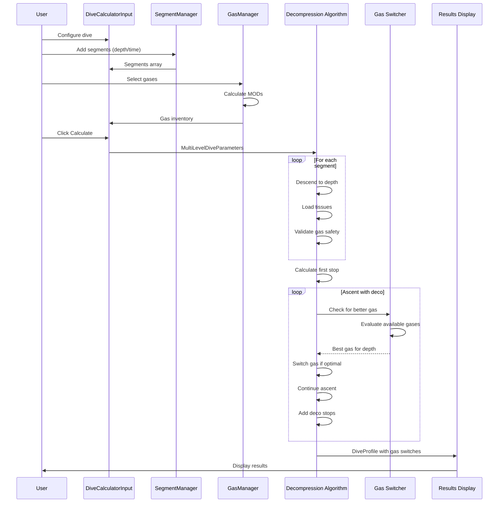
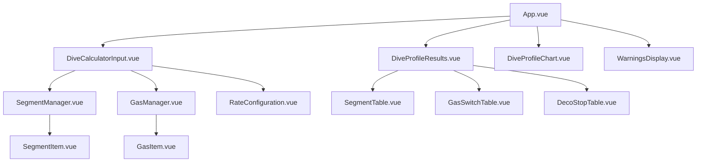
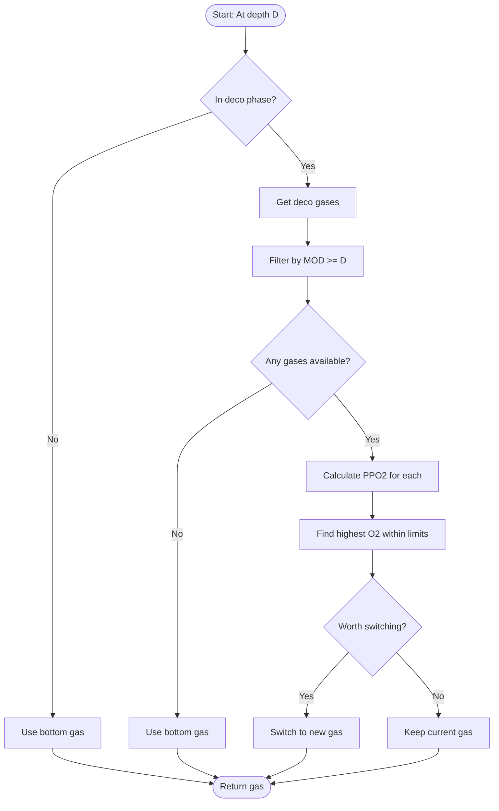
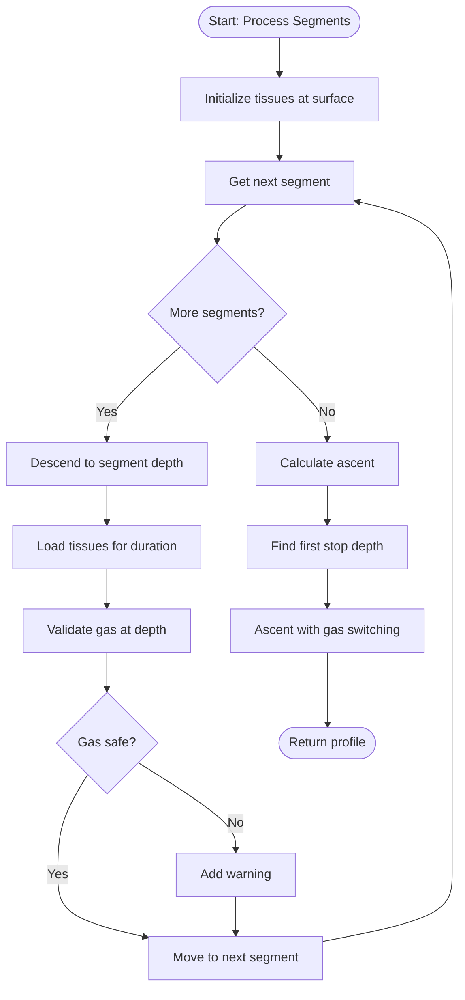
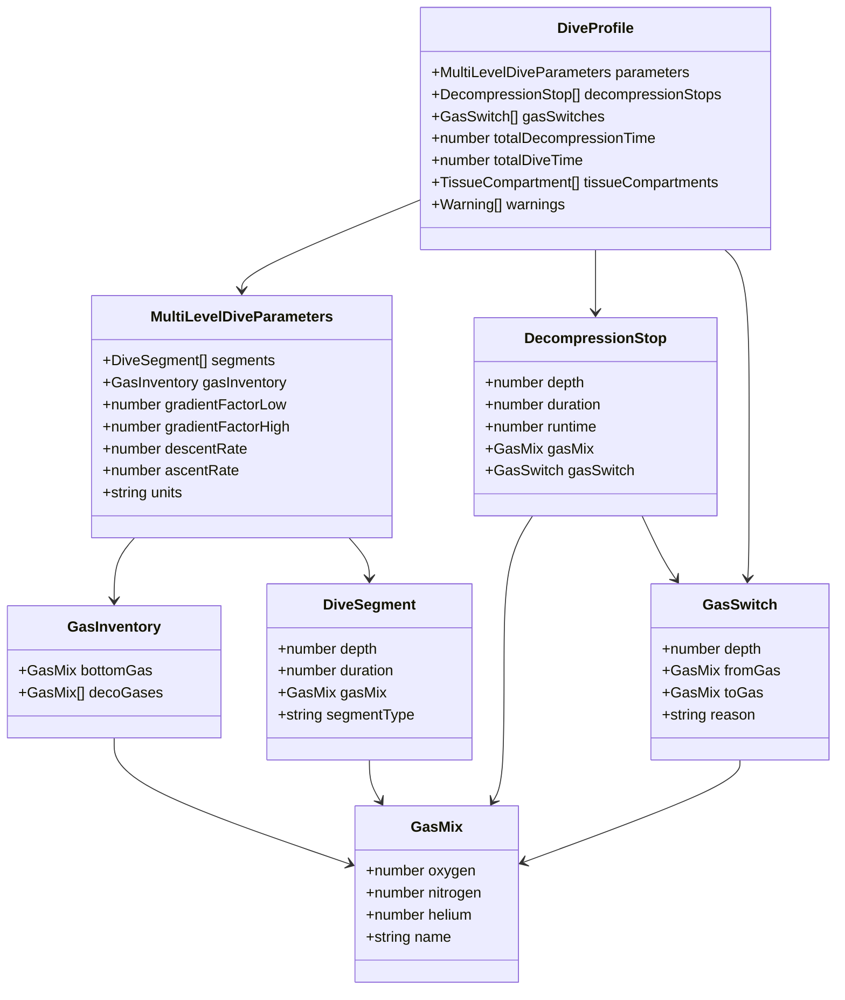
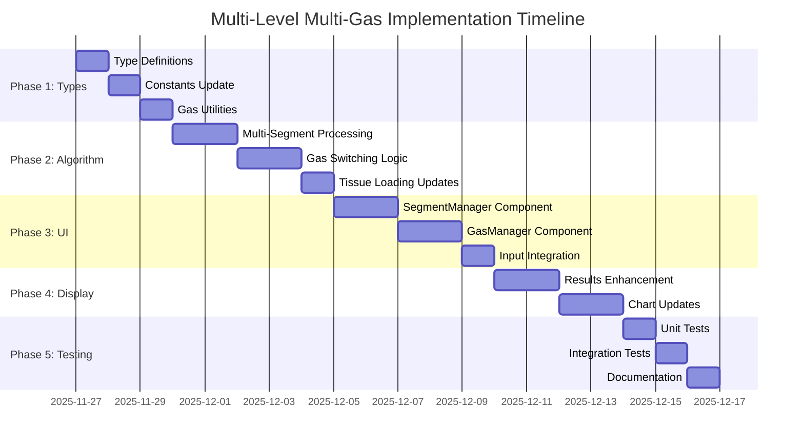

# Multi-Level Multi-Gas Architecture Diagram

## System Architecture Overview



## Data Flow Diagram



## Component Hierarchy



## Gas Selection Algorithm Flow



## Multi-Level Segment Processing



## Type Relationships



## UI Layout Structure

```
┌─────────────────────────────────────────────────────────────────┐
│                    Decompression Calculator                      │
│                  Bühlmann ZHL-16C with Multi-Gas                │
└─────────────────────────────────────────────────────────────────┘

┌──────────────────────┬──────────────────────────────────────────┐
│  INPUT PANEL         │  RESULTS PANEL                           │
│                      │                                          │
│ ┌──────────────────┐ │ ┌──────────────────────────────────────┐ │
│ │ Dive Segments    │ │ │ Warnings & Information               │ │
│ │ ┌──────────────┐ │ │ │ • Decompression required             │ │
│ │ │ Seg 1: 30m   │ │ │ │ • Gas switch at 21m                  │ │
│ │ │ 15min        │ │ │ └──────────────────────────────────────┘ │
│ │ └──────────────┘ │ │                                          │
│ │ ┌──────────────┐ │ │ ┌──────────────────────────────────────┐ │
│ │ │ Seg 2: 25m   │ │ │ │ Dive Segments Summary                │ │
│ │ │ 10min        │ │ │ │ Depth | Time | Runtime | Gas         │ │
│ │ └──────────────┘ │ │ │ 30m   | 15m  | 16.5m   | Air         │ │
│ │ [+ Add Segment]  │ │ │ 25m   | 10m  | 27.0m   | Air         │ │
│ └──────────────────┘ │ └──────────────────────────────────────┘ │
│                      │                                          │
│ ┌──────────────────┐ │ ┌──────────────────────────────────────┐ │
│ │ Gas Configuration│ │ │ Decompression Schedule               │ │
│ │ Bottom: Air      │ │ │ Depth | Time | Runtime | Gas         │ │
│ │ Deco:            │ │ │ 21m   | 2m   | 45m     | Air→EAN50   │ │
│ │ • EAN50 (21m)   │ │ │ 18m   | 3m   | 48m     | EAN50       │ │
│ │ • O2 (6m)       │ │ │ 6m    | 5m   | 53m     | EAN50→O2    │ │
│ │ [+ Add Gas]     │ │ └──────────────────────────────────────┘ │
│ └──────────────────┘ │                                          │
│                      │ ┌──────────────────────────────────────┐ │
│ ┌──────────────────┐ │ │ Dive Profile Chart                   │ │
│ │ Rates            │ │ │                                      │ │
│ │ Descent: 20m/min │ │ │     [Multi-level profile graph]      │ │
│ │ Ascent: 9m/min   │ │ │                                      │ │
│ └──────────────────┘ │ └──────────────────────────────────────┘ │
│                      │                                          │
│ [Calculate Profile]  │                                          │
└──────────────────────┴──────────────────────────────────────────┘
```

## Implementation Phases Timeline



---

**Note**: This architecture supports backward compatibility with single-level dives while enabling advanced multi-level, multi-gas capabilities.