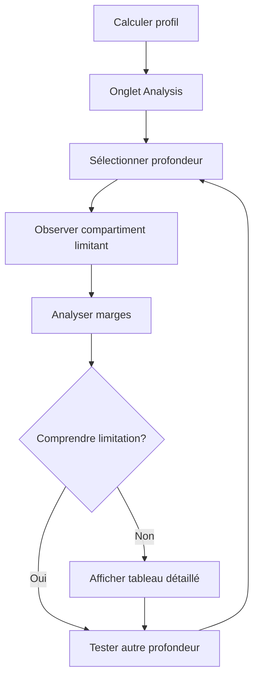

# 📊 Stop Analysis Mode - Documentation

## Vue d'ensemble

Le mode **Stop Analysis** (Analyse des paliers) est une fonctionnalité éducative avancée qui permet aux plongeurs de comprendre **pourquoi** certains paliers de décompression sont nécessaires en visualisant et analysant les compartiments tissulaires limitants.

## 🎯 Objectifs

- **Éducation** : Comprendre les principes de la décompression
- **Visualisation** : Voir l'état des 16 compartiments tissulaires à n'importe quelle profondeur
- **Analyse** : Identifier le compartiment limitant et comprendre les marges de sécurité
- **Planification** : Optimiser les profils de plongée en comprenant les limitations

## 🚀 Fonctionnalités

### 1. Sélection Interactive de Profondeur

- **Slider continu** : Sélectionnez n'importe quelle profondeur de 0m à la profondeur maximale de la plongée
- **Points de repère** : Accès rapide aux paliers de décompression existants
- **Incréments de 1m** : Analyse fine de n'importe quelle profondeur

### 2. Identification du Compartiment Limitant

Le système identifie automatiquement le compartiment tissulaire qui impose la contrainte la plus forte :

- **Compartiment limitant** : Celui avec le plafond (ceiling) le plus élevé
- **Mise en évidence visuelle** : Bordure rouge, badge "LIMITANT"
- **Explication contextuelle** : Pourquoi ce compartiment limite la remontée

### 3. Affichage des Marges de Sécurité

Pour chaque profondeur sélectionnée, le système affiche :

```
┌─────────────────────────────────────────┐
│ Pression tolérée max:    3.28 bar       │
│ Pression ambiante (12m): 2.20 bar       │
│ Marge restante:          1.08 bar (49%) │
│ Plafond:                 9m             │
└─────────────────────────────────────────┘
```

### 4. Visualisations Multiples

#### A. Graphique en Barres
- Affiche les 16 compartiments avec leur % de saturation
- Code couleur : Vert (<70%), Orange (70-90%), Rouge (>90%)
- Highlight du compartiment limitant

#### B. Tableau Détaillé
Informations complètes pour chaque compartiment :
- Numéro et demi-temps (half-time)
- Pression tissulaire actuelle (N₂ + He)
- Pression tolérée maximale (M-value ajusté)
- Marge en bars et pourcentage
- Plafond (ceiling) en mètres
- Statut de sécurité

## 📐 Calculs Techniques

### Pression Tissulaire
```
P_tissue = P_N2 + P_He
```

### Pression Tolérée (M-value ajusté)
```
P_tolerated = P_surface + (P_raw_tolerated - P_surface) × (GF / 100)
```

### Marge de Sécurité
```
Margin_bar = P_tolerated - P_ambient
Margin_% = (Margin_bar / P_ambient) × 100
```

### Plafond (Ceiling)
```
Ceiling = depth_from_pressure(P_tolerated)
```

## 🎨 Interface Utilisateur

### Layout Principal

```
┌─────────────────────────────────────────────────┐
│ 📊 Stop Analysis                                │
├─────────────────────────────────────────────────┤
│ Sélectionnez une profondeur :                   │
│ [Slider: 0m ────●──── 40m]  Profondeur: 12m    │
│ Paliers: [3m] [6m] [9m] [12m]                   │
├─────────────────────────────────────────────────┤
│ ⚠️ Compartiment Limitant: #5 (27.0 min)        │
│                                                  │
│ Pression tolérée max:    3.28 bar               │
│ Pression ambiante (12m): 2.20 bar               │
│ Marge restante:          1.08 bar (49%)         │
│ Plafond:                 9m                      │
│                                                  │
│ 💡 Vous ne pouvez pas remonter au-dessus de 9m  │
├─────────────────────────────────────────────────┤
│ [Graphique en Barres - 16 compartiments]        │
├─────────────────────────────────────────────────┤
│ [Bouton: Afficher le tableau détaillé]          │
│ [Tableau Détaillé - Collapsible]                │
└─────────────────────────────────────────────────┘
```

## 🔧 Architecture Technique

### Structure des Fichiers

```
src/
├── types/
│   └── stopAnalysis.ts              # Types TypeScript
├── services/
│   └── stopAnalysisService.ts       # Logique métier
├── components/
│   └── analysis/
│       ├── DepthSelector.vue        # Sélecteur de profondeur
│       ├── PressureMargins.vue      # Affichage des marges
│       ├── CompartmentChart.vue     # Graphique en barres
│       ├── CompartmentTable.vue     # Tableau détaillé
│       └── StopAnalysis.vue         # Composant principal
└── i18n/locales/
    ├── fr.json                      # Traductions françaises
    └── en.json                      # Traductions anglaises
```

### Types Principaux

```typescript
interface CompartmentAnalysis {
  compartmentNumber: number;
  n2HalfTime: number;
  tissuePressure: number;
  toleratedPressure: number;
  ambientPressure: number;
  marginBar: number;
  marginPercent: number;
  ceiling: number;
  isLimiting: boolean;
  status: 'safe' | 'caution' | 'danger';
  saturationPercent: number;
}

interface StopAnalysisResult {
  selectedDepth: number;
  compartments: CompartmentAnalysis[];
  limitingCompartment: CompartmentAnalysis;
  canAscendTo: number;
  isAscentSafe: boolean;
  explanation: string;
  currentGradientFactor: number;
}
```

## 📚 Cas d'Usage

### 1. Comprendre un Palier de Décompression

**Scénario** : Pourquoi dois-je faire un palier à 9m ?

1. Calculez votre profil de plongée
2. Allez dans l'onglet "Analysis"
3. Sélectionnez 9m avec le slider
4. Observez le compartiment limitant
5. Lisez l'explication contextuelle

**Résultat** : Vous comprenez quel compartiment impose ce palier et pourquoi.

### 2. Analyser les Marges de Sécurité

**Scénario** : Combien de marge ai-je à 6m ?

1. Sélectionnez 6m
2. Consultez le panneau "Marge de sécurité"
3. Voyez la marge en bars et en pourcentage
4. Comparez avec d'autres profondeurs

**Résultat** : Vous visualisez vos marges de sécurité à différentes profondeurs.

### 3. Optimiser un Profil Multi-Niveaux

**Scénario** : Puis-je remonter de 15m à 12m ?

1. Calculez votre profil multi-niveaux
2. Sélectionnez 12m dans l'analyse
3. Vérifiez si le plafond est ≤ 12m
4. Consultez les marges disponibles

**Résultat** : Décision éclairée sur la faisabilité de la remontée.

## ⚠️ Limitations et Avertissements

### Limitations Techniques

1. **Analyse statique** : L'analyse montre l'état des tissus à un instant donné, pas l'évolution dans le temps
2. **Pas de prédiction** : Ne prédit pas comment les tissus évolueront pendant un palier
3. **Simplifications** : Utilise le modèle Bühlmann ZHL-16C standard

### Avertissements de Sécurité

⚠️ **IMPORTANT** : Ce mode est à usage **éducatif uniquement**

- ❌ Ne remplace PAS un ordinateur de plongée certifié
- ❌ Ne doit PAS être utilisé pour planifier des plongées réelles
- ✅ Utilisez toujours un ordinateur de plongée certifié
- ✅ Ne plongez jamais au-delà de votre niveau de formation

## 🎓 Concepts Pédagogiques

### Compartiments Tissulaires

Le modèle Bühlmann ZHL-16C utilise 16 compartiments avec des demi-temps différents :

- **Rapides** (4-8 min) : Saturent et désaturent rapidement
- **Moyens** (12.5-40 min) : Équilibre
- **Lents** (54-635 min) : Saturent et désaturent lentement

### Gradient Factors

Les GF modifient les M-values pour plus de conservatisme :

- **GF Low** : Appliqué au premier palier
- **GF High** : Appliqué en surface
- **Interpolation linéaire** : Entre les deux

### Plafond (Ceiling)

Le plafond est la profondeur minimale sûre :

```
Si P_tissue > P_tolerated à une profondeur
→ Le plafond est plus profond
→ Remontée impossible
```

## 🔄 Workflow Typique



## 🌐 Internationalisation

Le mode est entièrement traduit en :
- 🇫🇷 Français
- 🇬🇧 Anglais

Toutes les chaînes de caractères utilisent le système i18n de Vue.

## 🚀 Évolutions Futures

### Améliorations Possibles

1. **Animation temporelle** : Voir l'évolution des tissus pendant un palier
2. **Comparaison de profils** : Comparer différents profils côte à côte
3. **Export des données** : Exporter l'analyse en PDF ou CSV
4. **Graphiques avancés** : Graphiques 3D, évolution temporelle
5. **Recommandations** : Suggestions d'optimisation du profil

### Intégrations Potentielles

- Export vers ordinateurs de plongée
- Intégration avec carnets de plongée numériques
- API pour applications tierces

## 📞 Support et Contribution

Pour toute question ou suggestion :
- Ouvrir une issue sur GitHub
- Consulter la documentation utilisateur
- Contacter l'équipe de développement

---

**Made with Bob** | Implémentation de l'algorithme Bühlmann ZHL-16C avec analyse avancée des compartiments tissulaires.