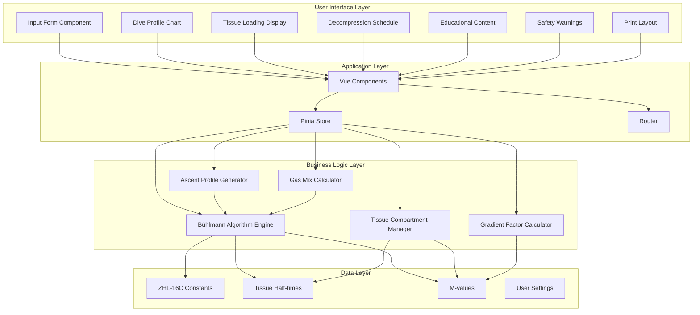
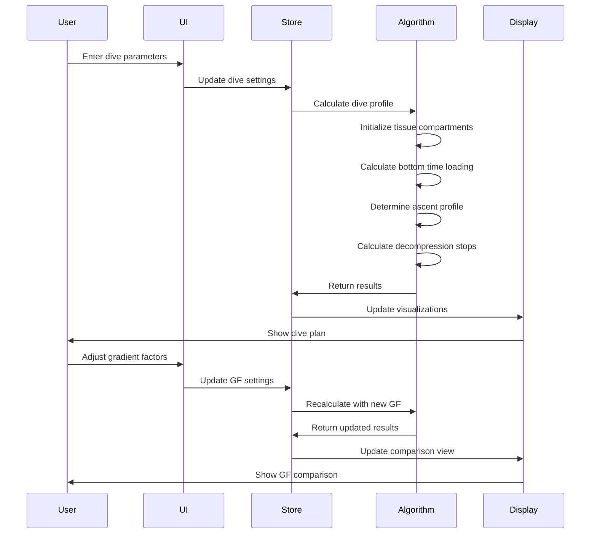

# Decompression Calculator - Technical Architecture

## Project Overview

A comprehensive web application for calculating decompression schedules using the Bühlmann ZHL-16C algorithm. This educational tool provides accurate dive planning with visualizations, safety warnings, and detailed explanations of decompression theory.

## Technology Stack

- **Framework**: Vue.js 3 (Composition API)
- **Build Tool**: Vite
- **State Management**: Pinia
- **Routing**: Vue Router
- **Charts**: Chart.js with vue-chartjs
- **Styling**: Tailwind CSS
- **Language**: TypeScript for type safety

## System Architecture



## Core Algorithm Components

### 1. Bühlmann ZHL-16C Algorithm

The algorithm uses 16 theoretical tissue compartments with different nitrogen half-times:

| Compartment | N2 Half-time (min) | He Half-time (min) |
|-------------|-------------------|-------------------|
| 1 | 4.0 | 1.51 |
| 2 | 8.0 | 3.02 |
| 3 | 12.5 | 4.72 |
| 4 | 18.5 | 6.99 |
| 5 | 27.0 | 10.21 |
| 6 | 38.3 | 14.48 |
| 7 | 54.3 | 20.53 |
| 8 | 77.0 | 29.11 |
| 9 | 109.0 | 41.20 |
| 10 | 146.0 | 55.19 |
| 11 | 187.0 | 70.69 |
| 12 | 239.0 | 90.34 |
| 13 | 305.0 | 115.29 |
| 14 | 390.0 | 147.42 |
| 15 | 498.0 | 188.24 |
| 16 | 635.0 | 240.03 |

### 2. Key Calculations

#### Tissue Loading Formula
```
P_tissue(t) = P_inspired + (P_initial - P_inspired) × e^(-k×t)
```
Where:
- k = ln(2) / half-time
- P_inspired = (P_ambient - P_water_vapor) × f_gas
- t = time at depth

#### M-value Calculation
```
M-value = M0 + ΔM × (P_ambient / P_surface)
```

#### Gradient Factor Application
```
GF_current = GF_low + (GF_high - GF_low) × (depth_current - depth_first_stop) / (depth_surface - depth_first_stop)
M-value_adjusted = M-value × GF_current
```

## Application Flow



## Component Structure

### Core Components

1. **DiveInputForm.vue**
   - Depth input (meters/feet)
   - Bottom time input
   - Gas mix selector (Air, EAN32, EAN36, Custom)
   - Gradient factor sliders (GF Low/High)
   - Calculate button

2. **DiveProfileChart.vue**
   - Line chart showing depth vs time
   - Highlights decompression stops
   - Shows ascent rate
   - Interactive tooltips

3. **TissueLoadingDisplay.vue**
   - 16 horizontal bar charts
   - Color-coded by saturation level
   - Shows M-value limits
   - Real-time updates during calculation

4. **DecompressionSchedule.vue**
   - Table format with columns:
     - Stop Depth
     - Stop Time
     - Runtime
     - Gas Mix
   - Total decompression time
   - Total dive time

5. **SafetyWarnings.vue**
   - NDL exceeded warnings
   - Rapid ascent alerts
   - Ceiling violation warnings
   - Gas supply considerations

6. **EducationalPanel.vue**
   - Algorithm explanation
   - Tissue compartment theory
   - Gradient factor effects
   - Safety considerations

7. **GradientFactorComparison.vue**
   - Side-by-side profile comparison
   - Different GF settings
   - Decompression time differences
   - Conservative vs aggressive profiles

8. **PrintableDivePlan.vue**
   - Formatted for printing
   - Includes all critical information
   - Emergency procedures
   - Dive site information fields

## Data Models

### Dive Parameters
```typescript
interface DiveParameters {
  depth: number;           // meters
  bottomTime: number;      // minutes
  gasMix: GasMix;
  gradientFactorLow: number;   // 0-100
  gradientFactorHigh: number;  // 0-100
  units: 'metric' | 'imperial';
}

interface GasMix {
  oxygen: number;    // percentage
  nitrogen: number;  // percentage
  helium: number;    // percentage
}
```

### Tissue Compartment
```typescript
interface TissueCompartment {
  number: number;
  nitrogenHalfTime: number;
  heliumHalfTime: number;
  nitrogenPressure: number;
  heliumPressure: number;
  m0: number;
  deltaM: number;
  mValue: number;
  ceiling: number;
}
```

### Decompression Stop
```typescript
interface DecompressionStop {
  depth: number;
  duration: number;
  runtime: number;
  gasMix: GasMix;
}
```

### Dive Profile
```typescript
interface DiveProfile {
  parameters: DiveParameters;
  decompressionStops: DecompressionStop[];
  totalDecompressionTime: number;
  totalDiveTime: number;
  noDecompressionLimit: number;
  tissueCompartments: TissueCompartment[];
  warnings: Warning[];
}
```

## Safety Features

1. **Input Validation**
   - Maximum depth limits (40m for recreational)
   - Reasonable bottom time ranges
   - Valid gas mix percentages
   - Gradient factor constraints

2. **Warning System**
   - Exceeding no-decompression limits
   - Rapid ascent rates (>9m/min)
   - Ceiling violations
   - Oxygen toxicity (PPO2 > 1.4 bar)
   - Nitrogen narcosis depth warnings

3. **Conservative Defaults**
   - GF Low: 30
   - GF High: 85
   - Safety stop: 3 min at 5m
   - Ascent rate: 9m/min

## File Structure

```
decompression-calculator/
├── public/
│   └── favicon.ico
├── src/
│   ├── assets/
│   │   └── styles/
│   │       └── main.css
│   ├── components/
│   │   ├── DiveInputForm.vue
│   │   ├── DiveProfileChart.vue
│   │   ├── TissueLoadingDisplay.vue
│   │   ├── DecompressionSchedule.vue
│   │   ├── SafetyWarnings.vue
│   │   ├── EducationalPanel.vue
│   │   ├── GradientFactorComparison.vue
│   │   └── PrintableDivePlan.vue
│   ├── composables/
│   │   ├── useBuhlmann.ts
│   │   ├── useGasMix.ts
│   │   └── useUnits.ts
│   ├── stores/
│   │   ├── diveStore.ts
│   │   └── settingsStore.ts
│   ├── utils/
│   │   ├── buhlmann.ts
│   │   ├── gasMix.ts
│   │   ├── conversions.ts
│   │   └── constants.ts
│   ├── types/
│   │   └── index.ts
│   ├── views/
│   │   ├── CalculatorView.vue
│   │   ├── EducationView.vue
│   │   └── AboutView.vue
│   ├── App.vue
│   └── main.ts
├── package.json
├── vite.config.ts
├── tsconfig.json
└── tailwind.config.js
```

## Implementation Phases

### Phase 1: Core Algorithm (Priority: High)
- Implement Bühlmann ZHL-16C calculations
- Tissue compartment management
- Gas mix calculations
- Gradient factor logic

### Phase 2: Basic UI (Priority: High)
- Input form
- Results display
- Basic validation

### Phase 3: Visualizations (Priority: Medium)
- Dive profile chart
- Tissue loading display
- Decompression schedule table

### Phase 4: Advanced Features (Priority: Medium)
- Gradient factor comparison
- Safety warnings
- Educational content

### Phase 5: Polish (Priority: Low)
- Print functionality
- Responsive design
- Documentation
- Example scenarios

## Testing Strategy

1. **Algorithm Validation**
   - Compare against published dive tables
   - Test edge cases (deep dives, long bottom times)
   - Verify gradient factor effects

2. **Unit Tests**
   - Tissue loading calculations
   - Gas mix calculations
   - Conversion utilities

3. **Integration Tests**
   - Complete dive profile generation
   - UI component interactions
   - State management

4. **User Acceptance Testing**
   - Usability testing
   - Educational content clarity
   - Print layout verification

## Performance Considerations

- Calculations run in real-time (<100ms)
- Debounce input changes
- Lazy load educational content
- Optimize chart rendering
- Cache calculation results

## Accessibility

- WCAG 2.1 AA compliance
- Keyboard navigation
- Screen reader support
- High contrast mode
- Clear error messages

## Future Enhancements

- Multi-level dive profiles
- Repetitive dive calculations
- Surface interval tracking
- Gas switching support
- Dive log integration
- Mobile app version
- Offline capability