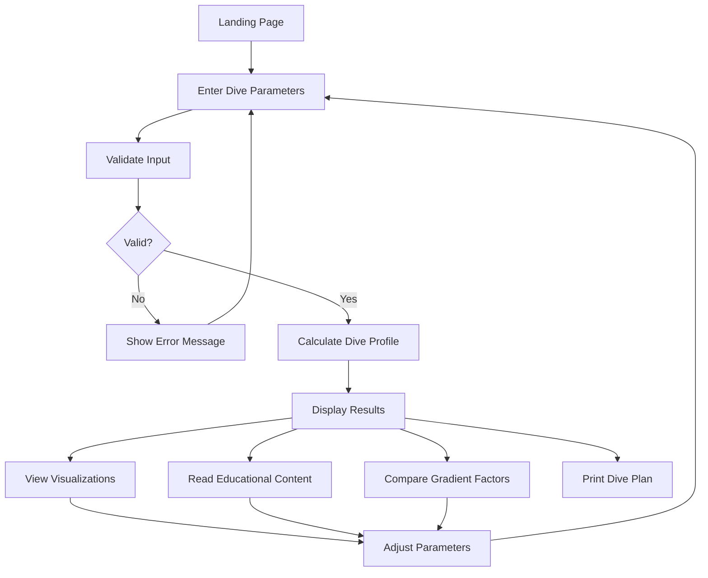

# Decompression Calculator - UI Design & Mockup

## Design Philosophy

- **Clean and Professional**: Medical/technical aesthetic appropriate for dive planning
- **Information Hierarchy**: Critical safety information prominently displayed
- **Progressive Disclosure**: Advanced features accessible but not overwhelming
- **Responsive**: Works seamlessly on desktop, tablet, and mobile devices
- **Accessible**: WCAG 2.1 AA compliant with keyboard navigation

## Color Scheme

### Primary Colors
- **Deep Blue**: `#0A4D68` - Headers, primary buttons, depth indicators
- **Ocean Blue**: `#088395` - Secondary elements, links
- **Light Blue**: `#05BFDB` - Accents, highlights
- **Aqua**: `#00FFCA` - Success states, safe zones

### Semantic Colors
- **Warning Orange**: `#FF9800` - Caution alerts, NDL warnings
- **Danger Red**: `#F44336` - Critical warnings, ceiling violations
- **Success Green**: `#4CAF50` - Safe conditions, completed calculations
- **Info Blue**: `#2196F3` - Educational content, tooltips

### Neutral Colors
- **Dark Gray**: `#263238` - Text, borders
- **Medium Gray**: `#546E7A` - Secondary text
- **Light Gray**: `#ECEFF1` - Backgrounds, disabled states
- **White**: `#FFFFFF` - Cards, content areas

## Layout Structure

```
┌─────────────────────────────────────────────────────────────┐
│                        HEADER                                │
│  🌊 Decompression Calculator    [Calculator] [Education]    │
└─────────────────────────────────────────────────────────────┘
┌─────────────────────────────────────────────────────────────┐
│                     MAIN CONTENT AREA                        │
│  ┌──────────────────┐  ┌────────────────────────────────┐  │
│  │                  │  │                                │  │
│  │  INPUT PANEL     │  │    RESULTS PANEL               │  │
│  │                  │  │                                │  │
│  │  - Depth         │  │  - Dive Profile Chart          │  │
│  │  - Bottom Time   │  │  - Decompression Schedule      │  │
│  │  - Gas Mix       │  │  - Tissue Loading Display      │  │
│  │  - Gradient      │  │  - Safety Warnings             │  │
│  │    Factors       │  │                                │  │
│  │                  │  │                                │  │
│  │  [Calculate]     │  │                                │  │
│  │                  │  │                                │  │
│  └──────────────────┘  └────────────────────────────────┘  │
│                                                              │
│  ┌──────────────────────────────────────────────────────┐  │
│  │         EDUCATIONAL CONTENT (Expandable)             │  │
│  └──────────────────────────────────────────────────────┘  │
└─────────────────────────────────────────────────────────────┘
┌─────────────────────────────────────────────────────────────┐
│                        FOOTER                                │
│  ⚠️ For educational purposes only - Not for actual diving   │
└─────────────────────────────────────────────────────────────┘
```

## Component Mockups

### 1. Input Panel

```
┌─────────────────────────────────┐
│  Dive Parameters                │
├─────────────────────────────────┤
│                                 │
│  Depth (meters)                 │
│  ┌───────────────────────────┐ │
│  │ 30                    ▼   │ │
│  └───────────────────────────┘ │
│  [━━━━━━━━━━━━━━━━━━━━━━━━━] │
│  0m                        40m  │
│                                 │
│  Bottom Time (minutes)          │
│  ┌───────────────────────────┐ │
│  │ 25                    ▼   │ │
│  └───────────────────────────┘ │
│  [━━━━━━━━━━━━━━━━━━━━━━━━━] │
│  0min                     60min │
│                                 │
│  Gas Mix                        │
│  ┌───────────────────────────┐ │
│  │ Air (21% O2)          ▼   │ │
│  └───────────────────────────┘ │
│  Options: Air, EAN32, EAN36,   │
│           Custom                │
│                                 │
│  Gradient Factors               │
│  GF Low:  30% [━━━━━━━━━━━━━] │
│  GF High: 85% [━━━━━━━━━━━━━] │
│                                 │
│  Units: ○ Metric  ○ Imperial   │
│                                 │
│  ┌───────────────────────────┐ │
│  │    Calculate Dive Plan    │ │
│  └───────────────────────────┘ │
│                                 │
│  [Advanced Options ▼]           │
└─────────────────────────────────┘
```

### 2. Dive Profile Chart

```
┌─────────────────────────────────────────────────┐
│  Dive Profile                                   │
├─────────────────────────────────────────────────┤
│                                                 │
│  0m  ─────────────────────────────────────────  │
│                                          ╱      │
│  5m                                    ╱        │
│                                      ╱          │
│  10m                               ╱ ⏸ 3min    │
│                                  ╱              │
│  15m                           ╱ ⏸ 2min        │
│                              ╱                  │
│  20m                       ╱ ⏸ 5min            │
│                          ╱                      │
│  25m                   ╱                        │
│                      ╱                          │
│  30m  ──────────────                            │
│       └─────────────────────────────────────┘   │
│       0min    10min   20min   30min   40min     │
│                                                 │
│  Legend:                                        │
│  ─── Bottom Time  ╱ Ascent  ⏸ Deco Stop       │
└─────────────────────────────────────────────────┘
```

### 3. Decompression Schedule Table

```
┌─────────────────────────────────────────────────┐
│  Decompression Schedule                         │
├─────────────────────────────────────────────────┤
│                                                 │
│  ┌──────┬──────────┬─────────┬──────────────┐ │
│  │ Depth│ Duration │ Runtime │ Gas Mix      │ │
│  ├──────┼──────────┼─────────┼──────────────┤ │
│  │ 20m  │  5 min   │  35 min │ Air (21% O2) │ │
│  │ 15m  │  2 min   │  37 min │ Air (21% O2) │ │
│  │ 10m  │  3 min   │  40 min │ Air (21% O2) │ │
│  │  5m  │  3 min   │  43 min │ Air (21% O2) │ │
│  └──────┴──────────┴─────────┴──────────────┘ │
│                                                 │
│  📊 Summary:                                    │
│  • Bottom Time: 30 minutes                      │
│  • Decompression Time: 13 minutes               │
│  • Total Dive Time: 43 minutes                  │
│  • Ascent Rate: 9 m/min                         │
│                                                 │
│  [📄 Print Dive Plan] [💾 Save]                │
└─────────────────────────────────────────────────┘
```

### 4. Tissue Loading Display

```
┌─────────────────────────────────────────────────┐
│  Tissue Compartment Loading                     │
├─────────────────────────────────────────────────┤
│                                                 │
│  Compartment 1  (4.0 min)                       │
│  [████████████████████░░░░░░░░] 75%            │
│                                                 │
│  Compartment 2  (8.0 min)                       │
│  [██████████████████░░░░░░░░░░] 68%            │
│                                                 │
│  Compartment 3  (12.5 min)                      │
│  [████████████████░░░░░░░░░░░░] 62%            │
│                                                 │
│  Compartment 4  (18.5 min)                      │
│  [██████████████░░░░░░░░░░░░░░] 58%            │
│                                                 │
│  ... (show all 16 compartments)                 │
│                                                 │
│  Legend:                                        │
│  ░░░ Safe  ▓▓▓ Caution  ███ Near Limit         │
│                                                 │
│  ℹ️ Hover over bars for detailed information    │
└─────────────────────────────────────────────────┘
```

### 5. Safety Warnings Panel

```
┌─────────────────────────────────────────────────┐
│  Safety Warnings                                │
├─────────────────────────────────────────────────┤
│                                                 │
│  ✅ No critical warnings                        │
│                                                 │
│  ⚠️  Cautions:                                  │
│  • This dive exceeds no-decompression limits    │
│  • Mandatory decompression stops required       │
│  • Maximum depth: 30m (recreational limit)      │
│                                                 │
│  ℹ️  Information:                               │
│  • Surface interval before next dive: 3+ hours  │
│  • Recommended safety stop: 3 min at 5m         │
│  • Ascent rate must not exceed 9 m/min          │
│                                                 │
│  ⚠️  DISCLAIMER:                                │
│  This calculator is for educational purposes    │
│  only. Always use certified dive computers      │
│  and follow proper dive planning procedures.    │
└─────────────────────────────────────────────────┘
```

### 6. Gradient Factor Comparison

```
┌─────────────────────────────────────────────────┐
│  Gradient Factor Comparison                     │
├─────────────────────────────────────────────────┤
│                                                 │
│  Compare different GF settings:                 │
│                                                 │
│  ┌──────────────────┬──────────────────────┐   │
│  │  GF 30/70        │  GF 40/85            │   │
│  │  (Conservative)  │  (Standard)          │   │
│  ├──────────────────┼──────────────────────┤   │
│  │  First Stop: 24m │  First Stop: 21m     │   │
│  │  Deco Time: 18m  │  Deco Time: 13m      │   │
│  │  Total: 48 min   │  Total: 43 min       │   │
│  │                  │                      │   │
│  │  [View Profile]  │  [View Profile]      │   │
│  └──────────────────┴──────────────────────┘   │
│                                                 │
│  ℹ️  Conservative GF settings provide extra     │
│     safety margin but require longer deco time  │
└─────────────────────────────────────────────────┘
```

### 7. Educational Content Panel

```
┌─────────────────────────────────────────────────┐
│  📚 Understanding the Bühlmann Algorithm        │
├─────────────────────────────────────────────────┤
│                                                 │
│  [▼ What is Decompression?]                     │
│  [▼ Tissue Compartments Explained]              │
│  [▼ M-values and Gradient Factors]              │
│  [▼ How to Read the Results]                    │
│  [▼ Safety Considerations]                      │
│                                                 │
│  ┌─────────────────────────────────────────┐   │
│  │ What is Decompression?                  │   │
│  │                                         │   │
│  │ During a dive, your body absorbs inert  │   │
│  │ gases (nitrogen and helium) from your   │   │
│  │ breathing gas. The deeper and longer    │   │
│  │ you dive, the more gas is absorbed.     │   │
│  │                                         │   │
│  │ Decompression is the process of safely  │   │
│  │ releasing these gases as you ascend...  │   │
│  │                                         │   │
│  │ [Read More]                             │   │
│  └─────────────────────────────────────────┘   │
└─────────────────────────────────────────────────┘
```

### 8. Printable Dive Plan

```
┌─────────────────────────────────────────────────┐
│  DIVE PLAN                                      │
│  Generated: 2025-11-26 15:30                    │
├─────────────────────────────────────────────────┤
│                                                 │
│  DIVE PARAMETERS                                │
│  • Maximum Depth: 30 meters                     │
│  • Bottom Time: 30 minutes                      │
│  • Gas Mix: Air (21% O2, 79% N2)               │
│  • Gradient Factors: 30/85                      │
│                                                 │
│  DECOMPRESSION SCHEDULE                         │
│  ┌──────┬──────────┬─────────┐                 │
│  │ Depth│ Duration │ Runtime │                 │
│  ├──────┼──────────┼─────────┤                 │
│  │ 20m  │  5 min   │  35 min │                 │
│  │ 15m  │  2 min   │  37 min │                 │
│  │ 10m  │  3 min   │  40 min │                 │
│  │  5m  │  3 min   │  43 min │                 │
│  └──────┴──────────┴─────────┘                 │
│                                                 │
│  EMERGENCY INFORMATION                          │
│  • Missed Stop: Descend to stop depth           │
│  • Rapid Ascent: Stop, descend 5m, wait 5min   │
│  • Emergency Contact: [___________________]     │
│                                                 │
│  DIVE SITE INFORMATION                          │
│  • Location: [_____________________________]   │
│  • Buddy: [_________________________________]   │
│  • Entry Time: [____________________________]   │
│                                                 │
│  ⚠️  DISCLAIMER                                 │
│  This plan is for educational purposes only.    │
│  Always use certified equipment and follow      │
│  proper dive procedures.                        │
│                                                 │
│  Diver Signature: _______________  Date: ____   │
└─────────────────────────────────────────────────┘
```

## Responsive Design Breakpoints

### Desktop (≥1024px)
- Two-column layout (input left, results right)
- Full-width charts and visualizations
- Side-by-side gradient factor comparison

### Tablet (768px - 1023px)
- Single column layout with stacked sections
- Collapsible input panel
- Optimized chart sizes

### Mobile (≤767px)
- Vertical stack layout
- Simplified input controls
- Swipeable chart views
- Bottom sheet for detailed information

## Interactive Elements

### Tooltips
- Hover over tissue compartments for detailed info
- Hover over chart points for exact values
- Hover over warning icons for explanations

### Animations
- Smooth transitions between calculations
- Animated ascent visualization
- Progressive loading of tissue bars
- Fade-in for results

### Keyboard Navigation
- Tab through all input fields
- Arrow keys for sliders
- Enter to calculate
- Escape to close modals

## Accessibility Features

1. **Screen Reader Support**
   - ARIA labels on all interactive elements
   - Descriptive alt text for charts
   - Semantic HTML structure

2. **Keyboard Navigation**
   - All features accessible via keyboard
   - Visible focus indicators
   - Skip navigation links

3. **Visual Accessibility**
   - High contrast mode option
   - Adjustable font sizes
   - Color-blind friendly palette
   - Clear visual hierarchy

4. **Content Accessibility**
   - Plain language explanations
   - Glossary of technical terms
   - Multiple representation of data (chart + table)

## User Flow Diagram



## Design System Components

### Typography
- **Headings**: Roboto Bold
- **Body**: Roboto Regular
- **Monospace**: Roboto Mono (for numbers, data)

### Spacing Scale
- xs: 4px
- sm: 8px
- md: 16px
- lg: 24px
- xl: 32px
- 2xl: 48px

### Border Radius
- Small: 4px (buttons, inputs)
- Medium: 8px (cards)
- Large: 12px (modals)

### Shadows
- Light: 0 2px 4px rgba(0,0,0,0.1)
- Medium: 0 4px 8px rgba(0,0,0,0.15)
- Heavy: 0 8px 16px rgba(0,0,0,0.2)

## Animation Timing

- Fast: 150ms (hover states)
- Normal: 300ms (transitions)
- Slow: 500ms (page transitions)
- Easing: cubic-bezier(0.4, 0.0, 0.2, 1)

## Mobile-Specific Features

1. **Touch Gestures**
   - Swipe between chart views
   - Pinch to zoom on dive profile
   - Pull to refresh calculations

2. **Mobile Optimizations**
   - Larger touch targets (min 44x44px)
   - Simplified navigation
   - Bottom navigation bar
   - Floating action button for calculate

3. **Progressive Web App**
   - Offline capability
   - Add to home screen
   - Push notifications for dive reminders
   - Local storage for dive history

## Error States

### Input Errors
```
┌─────────────────────────────────┐
│  ⚠️  Invalid Input               │
│                                 │
│  Depth must be between 0-40m    │
│  for recreational diving.       │
│                                 │
│  [OK]                           │
└─────────────────────────────────┘
```

### Calculation Errors
```
┌─────────────────────────────────┐
│  ❌ Calculation Error            │
│                                 │
│  Unable to calculate safe       │
│  decompression profile.         │
│                                 │
│  This dive exceeds safe limits. │
│                                 │
│  [Adjust Parameters]            │
└─────────────────────────────────┘
```

### Loading States
```
┌─────────────────────────────────┐
│  ⏳ Calculating...               │
│                                 │
│  [████████████░░░░░░░░] 75%    │
│                                 │
│  Computing tissue loading...    │
└─────────────────────────────────┘
```

## Implementation Priority

1. **Phase 1**: Core input form and basic results display
2. **Phase 2**: Dive profile chart and decompression schedule
3. **Phase 3**: Tissue loading visualization
4. **Phase 4**: Educational content and tooltips
5. **Phase 5**: Gradient factor comparison and print functionality
6. **Phase 6**: Mobile optimization and PWA features